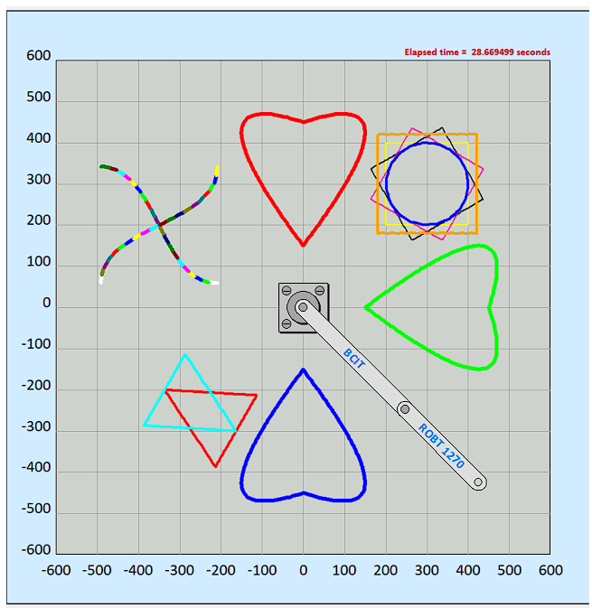
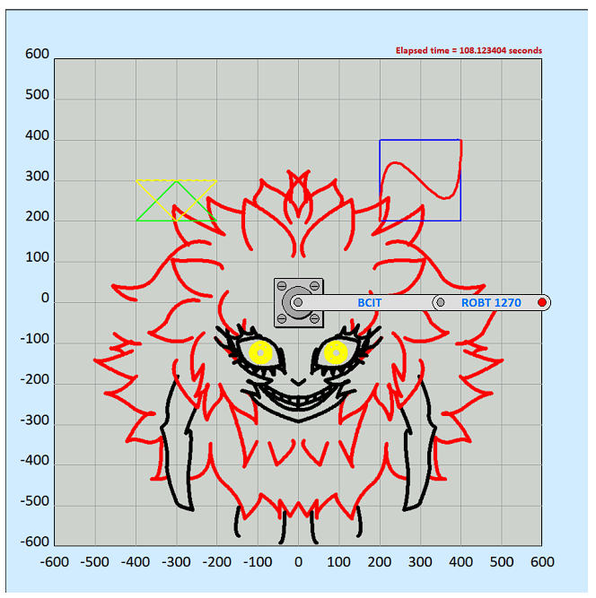

# SCARA Robot Drawing Application

This project demonstrates the use of a SCARA robot to draw complex shapes, such as the *Psycho Jenny* figure, by implementing inverse kinematics and geometric path generation. The robot uses Bezier curves, arcs, and lines to create intricate patterns based on input files and coordinates generated in **Inkscape**. This repository contains the C source code to operate the SCARA robot in simulation, utilizing remote control functionality.

## Key Features
- **Inverse Kinematics**: Solves for the SCARA robot's joint angles to move to specified x, y coordinates.
- **Drawing Shapes**: Utilizes parametric equations to compute points along lines, arcs, and quadratic Bezier curves.
- **Remote Control**: Interface with `ScaraRobotSim.exe` for drawing operations in simulation.
- **Image-to-Coordinates Mapping**: Converts images (such as *Psycho Jenny*) into a series of drawable commands for the robot.

## Prerequisites
- Visual Studio (or any C compiler)
- Inkscape (for generating coordinates)
- SCARA Robot Simulator (`ScaraRobotSim.exe`)

## Project Structure

### Core Files:
- **main.c**: (Previously `lab6.c`) The main control program for parsing input files and sending commands to the robot. 
- **constants.h**: Defines constants for the robot, including limits on joint angles, robot dimensions, etc.
- **task.in**: An example input file containing the commands to draw *Psycho Jenny*.

## Setup Instructions

### 1. Clone the Repository:
- Clone the repository and navigate to the project directory.

### 2. Image Preparation:
- Choose an image you'd like to draw.
- Open the image in **Inkscape**.
- Use Inkscape tools to trace the image using **Bezier curves**, **lines**, and **arcs**.
- Break the image into simple shapes and paths that the robot can draw.
- Use Inkscape's *path* tool to convert your traced shapes into coordinates.
- Extract the coordinates from Inkscape and format them according to the `task.in` file structure (see example in `task.in`).

### 3. SCARA Robot Simulator:
- Open `ScaraRobotSim.exe`.
- Enable **remote control** mode to allow external commands to move the robot.

### 4. Modify Input Files:
- Create or modify the input file (`task.in`) with your desired drawing commands.
- Each line of the file should specify a shape (e.g., line, arc, or Bezier curve), followed by coordinates and other attributes such as color and thickness.

Example `task.in` (from *Psycho Jenny* drawing):

QUADRATIC_BEZIER 0, 450, +300, 550, 0, 150, 31, THICK, RED
LINE -500, 0, +500, 0, MEDIUM, BLUE

### 5. Compile and Run:
- Open `main.c` in **Visual Studio**.
- Build and run the project. The code will:
  - Parse the input file (`task.in`).
  - Compute the inverse kinematics for each point.
  - Send commands to the SCARA robot simulator to draw the specified shapes.

- The SCARA robot will begin drawing the shapes based on the commands in `task.in`.

### 6. Drawing Optimization:
- You can optimize the drawing by minimizing pen lifts and path adjustments between different shapes.
- Ensure the start of the next shape is close to the end of the previous shape to reduce time spent moving the robot without drawing.

## Inverse Kinematics and Parametric Equations

### Line Drawing Equation:
For a straight line between two points P0(x0, y0) and P1(x1, y1):

pi = (1 - ti) * P0 + ti * P1

Where ti varies from 0 to 1 to generate the points along the line.

### Arc Equation:
For an arc with radius R and center (xc, yc) between start angle θstart and end angle θend:

xi = xc + R * cos(θi)  
yi = yc + R * sin(θi)

### Bezier Curve Equation:
For a quadratic Bezier curve defined by start point P0, control point P1, and end point P2:

P(t) = (1 - t)^2 * P0 + 2(1 - t) * t * P1 + t^2 * P2

## References to Code
- **main.c**: Contains functions like `inverseKinematics()`, `drawLine()`, `drawArc()`, and `drawQuadraticBezier()`.
- **constants.h**: Defines robot limits (e.g., maximum reach, angle constraints).
- **task.in**: Input file format for specifying shapes and drawing commands.

## Example Output
Once executed, the SCARA robot will follow the commands from `task.in` and replicate the desired drawing in the simulator. Below is the drawing of *Psycho Jenny* made by the robot:

## License
This project is licensed under the MIT License.
